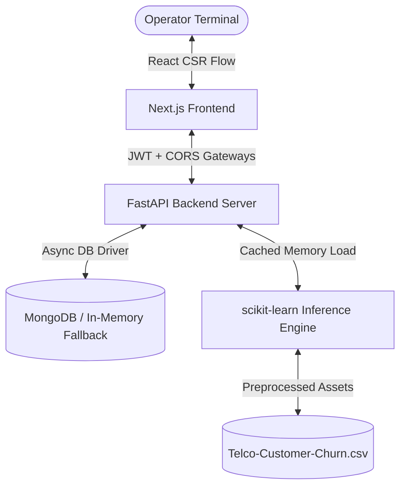

# ChurnRadar AI — Customer Retention Engine
## Project Technical Documentation & Viva Reference Manual

---

## 1. Executive Summary & Project Overview

**ChurnRadar AI** is a state-of-the-art, enterprise-grade full-stack customer retention engine designed to combat customer attrition (churn) in the telecom industry. Customer churn is a critical business metric representing the percentage of customers who stop doing business with an entity. Acquiring a new customer is historically 5 to 25 times more expensive than retaining an existing one. Thus, identifying high-risk customers proactively is a major objective for modern enterprise operations.

The ChurnRadar AI system solves this business problem by:
1. **Predicting Churn in Real Time:** Serving a serialized machine learning classifier that scores risk profiles in under 50 milliseconds.
2. **Interactive Telemetry HUD:** Providing operators with dynamic sliders (Tenure, Monthly Charges) and attributes (Contract, Internet Service) to run simulated what-if scenarios.
3. **Data-Driven Model Diagnostics:** Exposing live model evaluation statistics (Accuracy, Precision, Recall, F1-Harmonic) and an interactive Confusion Matrix to track model health.
4. **Secure Operator Auditing:** Restricting workspace access via OAuth2-compliant JSON Web Tokens (JWT) and Bcrypt cryptographic credentials validation.

---

## 2. System Architecture

The application is built on a modern decoupled architecture combining **FastAPI (Python)** for asynchronous backend processing and machine learning inference with **Next.js 16 (React 19)** for high-density rendering. 

### Data & Execution Flow
1. **Pipeline Training:** The machine learning pipeline ingest the IBM Telco Dataset (`Telco-Customer-Churn.csv`), cleans outliers, scales variables, trains a `RandomForestClassifier`, and serializes the model and preprocessing pipeline as `.pkl` artifacts.
2. **Model Persistence:** Metrics calculated during training are pushed to MongoDB, and serialized files (`model.pkl`, `preprocessor.pkl`) are saved to the backend assets folder.
3. **Authentication:** The operator requests an access token by submitting credentials to the `/api/auth/token` endpoint. On validation, the backend yields a stateless JWT.
4. **Inference Flow:** The client makes a POST request to `/api/predict` containing the simulated features. The backend service routes the parameters through the in-memory cached preprocessor and model, returning the predicted churn probability, LTV estimates, and custom recommended action workflows.
5. **Database Fallback:** If MongoDB is offline, a thread-safe `MockDatabase` layer takes over seamlessly in the backend, preventing runtime gateway crashes in development.

---

## 3. Technology Stack Deep-Dive (Why & How)

| Technology | Role | Why It Was Chosen | How It Is Used in the Project |
| :--- | :--- | :--- | :--- |
| **Python 3.10+** | Backend Environment | Standard for data science; hosts mature ecosystems for AI engineering. | Manages model training pipelines, dataset cleaning, and server runtimes. |
| **FastAPI** | REST API Framework | Exceptionally fast runtime (Uvicorn event-loop), native async support, and auto-generates OpenAPI specs. | Defines endpoints (`/auth`, `/predict`, `/metrics`), handles dependency injection. |
| **Next.js 16 & React 19** | Client Frontend | React Server/Client split allows flexible routing, faster client-side rendering (CSR), and reusable layouts. | Constructs the interactive Workspace dashboard, login, and model diagnostics. |
| **Tailwind CSS v4** | UI Styling & Theme Engine | Utility-first framework offering atomic CSS, theme isolation, custom animations, and responsive layouts. | Implements a high-density, cyberpunk "obsidian" styling system with glassmorphism and pulsing risk alerts. |
| **Scikit-learn** | Machine Learning Library | Standard tool for classical predictive modeling; highly optimized under the hood (C-libraries). | Preprocesses numerical/categorical variables and trains the Random Forest classifier. |
| **MongoDB & Motor** | Database Layer | Document-based storage matches JSON schemas natively; Motor provides non-blocking, async I/O database drivers. | Stores operator user accounts and historic model performance metrics. |
| **Bcrypt & PyJWT (python-jose)** | Security Protocol | Cryptographically secure hashing resistant to GPU cracking; stateless JWT tokens optimize cluster performance. | Hashing passwords upon registration; verifying logins and generating bearer authorization headers. |
| **Recharts** | Front-end Data Visualization | Declarative React charting engine rendered inside SVGs; fully responsive and supports animation. | Renders model parameters comparisons and performance charts. |

---

## 4. Machine Learning & Preprocessing Pipeline

### 4.1 Data Cleaning & Preparation (`preprocess.py`)
Raw customer data requires normalization before it is fed to mathematical classifiers. The cleaning pipeline handles:
- **String Parsing:** TotalCharges contains blank strings for new customers. The preprocessor filters these, converts the column to numeric, and fills empty spaces with the column median.
- **Duplicate Removal:** Eliminates redundant data lines to prevent training bias.
- **Outlier Mitigation:** During training, columns are normalized using the Interquartile Range (IQR) method:
  $$\text{IQR} = Q_3 - Q_1$$
  Any sample outside $[Q_1 - 1.5 \times \text{IQR}, Q_3 + 1.5 \times \text{IQR}]$ is dropped to prevent skewing model weights.
- **Target Mapping:** Maps the target string column `Churn` (`Yes`/`No`) into binary integers ($1$/$0$).

### 4.2 Feature Engineering
Feature transformations are packaged in a scikit-learn `ColumnTransformer` to guarantee identical transformations during training and real-time inference:
- **Numerical Scaling (`StandardScaler`):** Standardizes features (tenure and MonthlyCharges) by removing the mean and scaling to unit variance:
  $$z = \frac{x - \mu}{\sigma}$$
- **Categorical Encoding (`OneHotEncoder`):** Converts string values (Contract, InternetService) into one-hot binary arrays, avoiding arbitrary ordinal bias (e.g. Month-to-month, One year, Two year).

### 4.3 Model Architecture
- **Classifier:** `RandomForestClassifier(n_estimators=100, max_depth=10, random_state=42)`
- **Why Random Forest?** Random Forest is an ensemble learning method that fits multiple decision trees on random dataset subsets and averages their predictions. It resists overfitting (regularized by `max_depth`), naturally calculates feature importances, handles non-linear customer relationships, and outputs soft probability boundaries rather than just binary labels.

---

## 5. Viva Voce Q&A Reference Bank
*Tailored to the "Web Engineering and AI" University Course Curriculum*

### Part A: Web Engineering, Architecture & Integration

#### Q1: What is the benefit of using FastAPI over traditional frameworks like Django or Flask for AI deployment?
**Answer:** FastAPI is built on ASGI (Asynchronous Server Gateway Interface) rather than WSGI, making it native-async. It leverages **Uvicorn** (powered by `uvloop`) and **Pydantic** for type hints. For AI applications, this is critical because:
- **Performance:** It approaches the performance of NodeJS and Go.
- **Async concurrency:** It handles concurrent API requests for inference without blocking the execution thread.
- **Automatic documentation:** It automatically generates Swagger UI (`/docs`) and ReDoc (`/redoc`) configurations from source code typings.
- **Validation:** Pydantic automatically serializes and validates request bodies, returning explicit 422 errors for corrupt payloads.

#### Q2: Explain the OAuth2 flow and how stateless authentication works in ChurnRadar AI.
**Answer:** The security gateway uses the **OAuth2 Resource Owner Password Credentials** standard:
1. **Request:** The operator enters credentials which are sent via POST form-urlencoded to `/api/auth/token`.
2. **Verification:** The backend hashes the password using `bcrypt` and checks it against the database. If correct, it generates a JWT containing a payload (`sub` claim set to user email) signed with an HS256 key.
3. **Response:** The server returns the JWT token. The client stores this token in `localStorage`.
4. **Subsequent Calls:** For endpoints requiring authentication (like `/api/predict`), the client attaches the JWT to the HTTP `Authorization` header as `Bearer <token>`. The server decodes the signature statelessly to verify the operator identity without hitting a session storage table.

#### Q3: What is Cross-Origin Resource Sharing (CORS), and why is it configured in this application?
**Answer:** CORS is a security mechanism implemented by web browsers to restrict resource requests from domains outside the domain that served the primary page. In ChurnRadar:
- The frontend is served from `http://localhost:3000`.
- The backend API runs on `http://localhost:8000`.
- Because the ports differ, the browser blocks request payloads. To resolve this, the FastAPI backend configures `CORSMiddleware` to allow requests originating from the frontend origin, authorizing specific HTTP verbs (`GET`, `POST`) and authorization headers.

#### Q4: Why is there an In-Memory Database Fallback implemented in `db.py`?
**Answer:** Web applications should be robust to infrastructure outages. In a development environment, requiring a local MongoDB instance to run the application creates a barrier to entry. In `db.py`, the database service attempts to connect to MongoDB with a short timeout ($2000$ms). If it fails, it prints a fallback warning and instantiates an in-memory `MockDatabase` class. This mock class mimics asynchronous database transactions (`find_one`, `insert_one`), allowing the login, registration, and prediction caching systems to function smoothly in local testing.

#### Q5: Explain the difference between client-side state and server-side state in Next.js.
**Answer:** 
- **Client-Side State:** Lives inside the user's browser, managed by React hooks like `useState` or `useEffect` (e.g. current slider values for tenure, monthly charges, login inputs). It reset on page refresh unless persisted to `localStorage`.
- **Server-Side State:** Lives on the database and backend servers (e.g. registered users list, model metrics). It must be accessed by sending asynchronous HTTP requests (using `fetch` or Axios).

---

### Part B: Artificial Intelligence & Machine Learning Pipeline

#### Q6: Why did you scale numerical columns using `StandardScaler` rather than `MinMaxScaler`?
**Answer:** `StandardScaler` standardizes columns to have a mean of $0$ and a standard deviation of $1$ (Gaussian distribution). `MinMaxScaler` bound values strictly between $0$ and $1$. 
- **StandardScaler** is preferred for machine learning models (like Logistic Regression or SVMs) because it preserves the variance and handles potential outliers better without smashing features into a narrow margin.
- For Random Forests, strict scaling is not mathematically necessary because trees split variables based on ordinal boundaries, not distances. However, standardizing is a best practice to support pipeline modularity, should we replace the RandomForest classifier with distance-based or gradient-descent classifiers.

#### Q7: What is One-Hot Encoding, and why is it necessary for the columns 'Contract' and 'InternetService'?
**Answer:** Machine learning models are mathematical equations that process numeric inputs. Categorical string variables (such as Contract: "Month-to-month", "One year", "Two year") must be mapped to numeric formats.
- **Ordinal Encoding** (assigning $0, 1, 2$) implies a mathematical ordering: $\text{Two Year} (2) > \text{One Year} (1) > \text{Month-to-month} (0)$. This is acceptable for contracts, but for InternetService ("Fiber optic", "DSL", "No"), ordering them ($0, 1, 2$) implies a false relationship (e.g., Fiber optic is "more" than DSL).
- **One-Hot Encoding** creates binary column indicators (e.g., `InternetService_Fiber optic` = $0$ or $1$, `InternetService_DSL` = $0$ or $1$). This treats each category independently and avoids model bias.

#### Q8: Explain the significance of the `stratify` parameter when spliting data into training and test sets.
**Answer:** The dataset suffers from **class imbalance** (more customers stay than churn). If we perform a simple random split, the test set might receive a disproportionate number of non-churned clients, making test evaluation unrepresentative. Setting `stratify=y` inside `train_test_split` guarantees that the train and test subsets contain the exact same proportion of churned ($1$) vs retained ($0$) instances as the original source dataset.

#### Q9: What is a Random Forest? How does it differ from a single Decision Tree?
**Answer:** A single Decision Tree splits data based on feature thresholds that maximize information gain (using metric calculations like Gini impurity or Entropy). While intuitive, single trees overfit training data easily and are highly sensitive to noise.
A **Random Forest** is an ensemble algorithm:
- It builds an array of independent decision trees (configured to `n_estimators=100` in our pipeline).
- Each tree is trained on a bootstrap sample (random selection with replacement) of the training dataset.
- At each node split, only a random subset of features is evaluated.
- The final prediction is calculated by averaging tree outputs (regression) or taking a majority vote (classification). This reduces variance, dampens noise, and avoids overfitting.

#### Q10: Define the four components of a Confusion Matrix.
**Answer:** In binary classification (positive class = Churn ($1$), negative class = Stay ($0$)):
1. **True Positive (TP):** The model predicted the customer would churn, and the customer actually churned.
2. **False Positive (FP - Type I Error):** The model predicted the customer would churn, but the customer actually stayed.
3. **False Negative (FN - Type II Error):** The model predicted the customer would stay, but the customer actually churned.
4. **True Negative (TN):** The model predicted the customer would stay, and the customer actually stayed.

#### Q11: State the formula and explain the meaning of Accuracy, Precision, Recall, and F1-Score.
**Answer:**
- **Accuracy:** The ratio of correct predictions to total cases.
  $$\text{Accuracy} = \frac{\text{TP} + \text{TN}}{\text{TP} + \text{TN} + \text{FP} + \text{FN}}$$
- **Precision:** Of all customers predicted to churn, what percentage actually churned. Important when retention resources are scarce.
  $$\text{Precision} = \frac{\text{TP}}{\text{TP} + \text{FP}}$$
- **Recall (Sensitivity):** Of all customers who actually churned, what percentage did the model catch. Critical when the cost of losing a customer is high.
  $$\text{Recall} = \frac{\text{TP}}{\text{TP} + \text{FN}}$$
- **F1-Score:** The harmonic mean of precision and recall, balancing both metrics when datasets suffer from class imbalances.
  $$\text{F1} = 2 \times \frac{\text{Precision} \times \text{Recall}}{\text{Precision} + \text{Recall}}$$

#### Q12: In a Customer Churn scenario, which metric is more critical: Precision or Recall? Why?
**Answer:** **Recall** is generally more critical for customer churn.
- **Why:** If the model misses a churner (False Negative), that customer leaves, leading to lost revenue (high cost). If the model falsely flags a loyal customer as a churn risk (False Positive), the company may extend a retention offer (like a survey or a $10\%$ discount). While this incurs a minor retention cost, it is far less than losing the customer entirely.
- Ideally, the system uses the **F1-Score** to optimize the decision threshold, ensuring we capture maximum churners (high recall) without spending unnecessary budget on false alerts (precision).

---

### Part C: Security, Integration & Advanced AI-Web Engineering

#### Q1: What is the risk of using Python's default `pickle` library, and how does `joblib` compare?
**Answer:**
- **Security Risk:** Both libraries are vulnerable to **arbitrary code execution exploits** if deserializing an untrusted file. If an attacker swaps `model.pkl` with a payload containing a malicious `__reduce__` method, loading the artifact executes arbitrary shell commands.
- **Why joblib:** `joblib` is optimized for serializing large NumPy arrays common in scikit-learn models. It pickles model weight matrices faster by creating memory maps, which reduces boot latency for FastAPI.

#### Q2: How does the backend calculate LTV (Lifetime Value) dynamically on inference?
**Answer:** The application computes estimated Lifetime Value using the formula:
$$\text{LTV} = \text{Tenure} \times \text{Monthly Charges} \times 0.8$$
Here, $0.8$ represents a stability factor accounting for billing variance or early cancellation risks. If the calculated value is $\le 0$ (e.g. new customer), it defaults to $\text{Monthly Charges} \times 0.8$ to represent baseline contract expectations.

#### Q3: What is Model Drift, and how can this architecture handle it?
**Answer:** Model Drift occurs when the statistical properties of the target variable change over time, rendering predictions less accurate (e.g., changes in competitor prices, new product plans). 
- **Mitigation:** The `/api/metrics` endpoint queries MongoDB for the latest stats. We can run a nightly cron job that processes new customer telemetry, retrains the Random Forest, saves a timestamped `model.pkl`, and updates the metrics document in MongoDB. The FastAPI server reload the artifacts in-memory without downtime.

#### Q4: Why is `bcrypt` used directly instead of `passlib` wrappers for credentials verification?
**Answer:** In recent Python updates (especially Python 3.10+), `passlib` has become deprecated and frequently conflicts with newer security compilers, throwing warnings regarding internal module imports. Directly importing the compiled C-library `bcrypt` resolves dependency issues, executes password salting and hashing faster, and enforces the standard Blowfish block cipher algorithm directly.

---
*Developed for Web Engineering & AI Course Study Guide • ChurnRadar AI*
