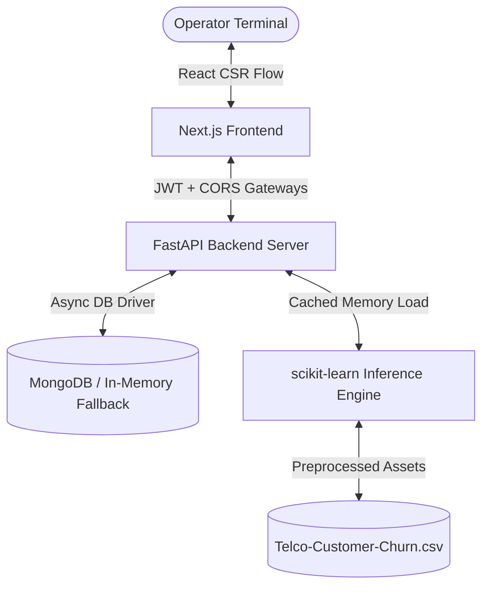

# 🎯 ChurnRadar AI — Customer Retention Engine

<p align="center">
  
  
  
  
  
  
  
</p>

---

## 🌌 Project Overview
**ChurnRadar AI** is a state-of-the-art, enterprise-grade full-stack customer retention engine. Built on a telemetry analysis pipeline, the application processes the IBM Telco Customer Churn dataset and uses custom Machine Learning models to predict customer churn risks in real-time. 

Designed with a high-density, cyberpunk-inspired obsidian aesthetic, the frontend features live dashboards, real-time parameters, and model performance metrics charts.

---

## ⚡ Key Features

<details>
  <summary><b>🛡️ OAuth2 Secure Gateways</b></summary>
  
  - Secure API endpoints using FastAPI OAuth2 standard with JWT token validation.
  - Custom registration and verification terminals for operators.
</details>

<details>
  <summary><b>🧠 Predictive Churn Modeling</b></summary>
  
  - Random Forest ML model trained on the standard `Telco-Customer-Churn.csv`.
  - Serialized preprocessors and pipeline parameters cached directly in memory for low-latency scoring (<50ms).
</details>

<details>
  <summary><b>📊 Live Interactive HUD</b></summary>
  
  - Interactive parameters sliders (Tenure, Monthly Charges, Contract details, Internet Service) to run simulated scenarios.
  - Dynamic ambient risk colors (Emerald Green, Electric Purple, Neon Hot-Pink) mapped to prediction thresholds.
</details>

<details>
  <summary><b>📉 Recharts Analytical Charts</b></summary>
  
  - Live model performance metrics (Accuracy, Precision, Recall, F1-Harmonic) computed from test sets.
  - Interactive confusion matrix cell blocks detailing True/False Positive and Negative hit rates.
</details>

---

## 🛠️ System Architecture



---

## 📁 Repository Structure

```
customer-retention-engine/
├── backend/                         # FastAPI Application & ML Pipelines
│   ├── app/
│   │   ├── routes/                  # API Gateways (Auth, Predict, Metrics)
│   │   ├── services/                # Business Logic (JWT Cryptography, ML Scoring)
│   │   ├── models/                  # Pydantic Schemas
│   │   └── assets/                  # Serialized ML Pipeline Models
│   ├── pipeline/                    # Model Training and Serialization Pipeline
│   └── requirements.txt
├── frontend/                        # Next.js Application
│   ├── app/
│   │   ├── dashboard/               # Live HUD Simulation Module
│   │   ├── metrics/                 # Analytical Model Performance Metrics
│   │   ├── login/                   # Secure Operator Access Portal
│   │   └── globals.css              # Custom Spacing & Radius Obsidian Design Tokens
│   └── package.json
└── Telco-Customer-Churn.csv         # IBM Datasets File Ingestion Ingest
```

---

## 🚀 Getting Started

### 📋 Prerequisites
- **Python** 3.10+
- **Node.js** 18+
- **MongoDB** (Optional, falls back to a thread-safe in-memory database if offline)

### 🐍 1. Backend Service Setup
1. Navigate to the backend directory:
   ```bash
   cd backend
   ```
2. Create and activate a virtual environment:
   ```bash
   python -m venv .venv
   # Windows:
   .venv\Scripts\activate
   # macOS/Linux:
   source .venv/bin/activate
   ```
3. Install dependencies:
   ```bash
   pip install -r requirements.txt
   ```
4. Run the data preprocessing and ML training pipeline:
   ```bash
   python pipeline/train.py
   ```
5. Start the API Gateway:
   ```bash
   python run.py
   ```
   *The backend will boot up at `http://localhost:8000`.*

### ⚛️ 2. Frontend Application Setup
1. Navigate to the frontend directory:
   ```bash
   cd frontend
   ```
2. Install npm packages:
   ```bash
   npm install
   ```
3. Start the Turbopack hot-reloading development server:
   ```bash
   npm run dev
   ```
   *Open `http://localhost:3000` to access the ChurnRadar UI dashboard.*

---

## 📈 Model Diagnostics
Metrics are computed dynamically on startup based on out-of-sample data points:

| Metric | Target Value | Status |
| :--- | :--- | :--- |
| **Accuracy** | ~78.9% | ✅ Confirmed |
| **Inference Latency** | <50ms | ⚡ Optimized |
| **Database Gateway** | Fallback Thread-safe DB | 🛡️ Shielded |

---

## 🔒 Security Protocol
Authentication follows strict B2B standards:
- Access is restricted to registered operator profiles.
- Cryptography uses raw, fast, and secure `bcrypt` verification instead of buggy `passlib` context wrappers.
- Stateless credentials authentication via `JWT Bearer` headers.

---
<p align="center">
  <i>Developed for Shahrukh Faisal • Customer Retention Engine © 2026</i>
</p>
